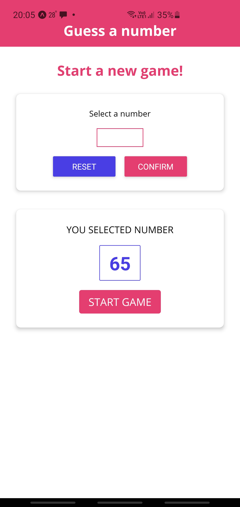
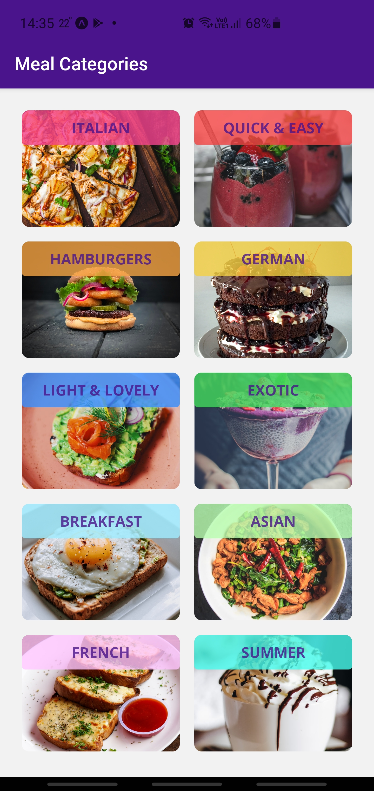
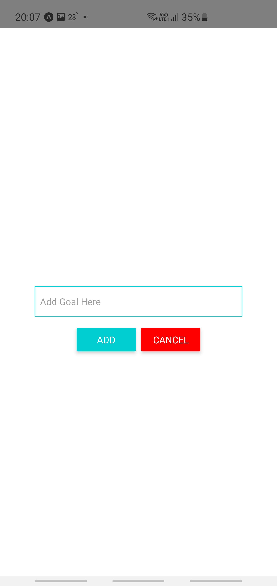

## React Native Apps

Different applications created with React Native and Expo for educational purposes.

1. TODO list

   Most basic start app for understanding a technology. Allows you to add goals and shows them as a list

2. GuessNumber

   Small app that suggests you to pick up a number. Then app will try to guess what number you chose.

3. Meals

Classic recipes app that shows different recipes grouped by categories

4. Shop

Classic shop app, shows products, allows to add items to the cart and create an order. Uses authentification,
server side data, device camera, google maps and user location, local storage and can send a notifications to users

5. Notification
   Basic example to show how to work with notifications

## Gallery

